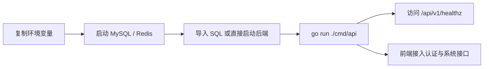
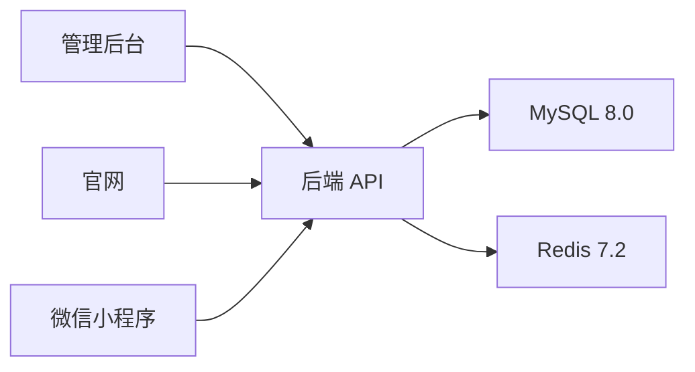
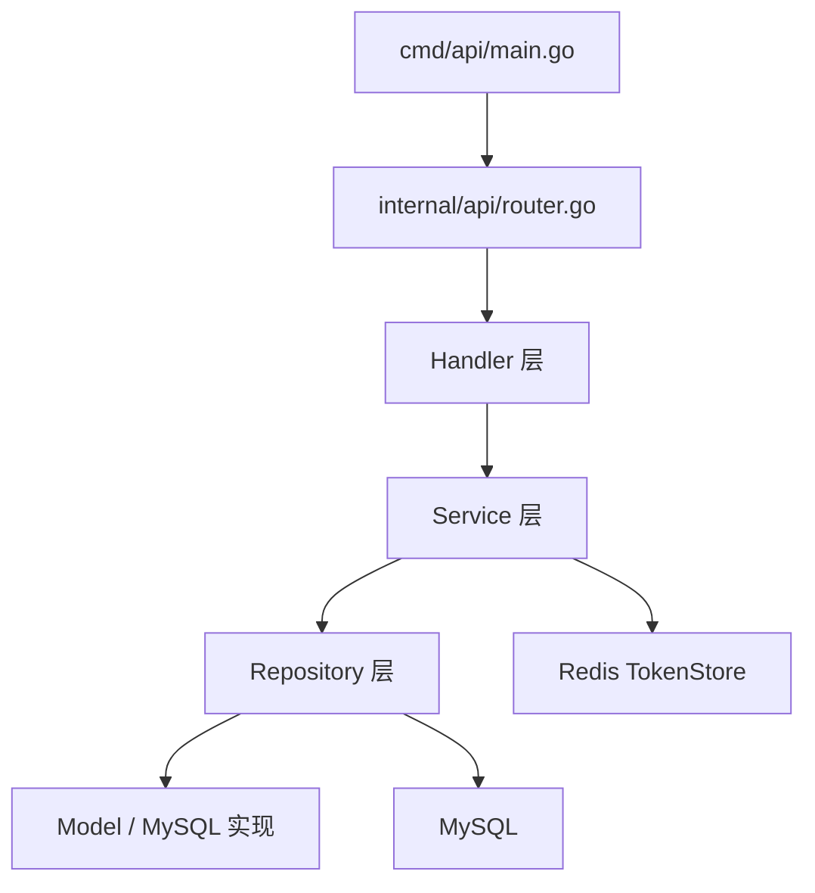
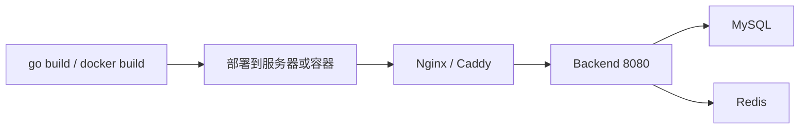

# template-go-backend


一套面向创业团队和中小项目的 Go 后端模板，内置统一响应、JWT + Refresh Token、RBAC、菜单管理、用户管理、官网联系表单、配置管理、日志、容器化和基础 CI。

## 预览图


## 治理文档

- [LICENSE](./LICENSE)
- [CONTRIBUTING.md](./CONTRIBUTING.md)
- [COMMIT_CONVENTION.md](./COMMIT_CONVENTION.md)
- [CODE_OF_CONDUCT.md](./CODE_OF_CONDUCT.md)
- [SECURITY.md](./SECURITY.md)
- [SUPPORT.md](./SUPPORT.md)
- [MAINTAINERS.md](./MAINTAINERS.md)
- [RELEASE.md](./RELEASE.md)
- [CHANGELOG.md](./CHANGELOG.md)
- [COLLABORATION.md](./COLLABORATION.md)

## 项目定位

- 技术栈：`Gin + GORM + Viper + Zap + JWT + Redis + MySQL`
- 分层结构：`API -> Service -> Repository`
- 使用场景：管理后台 API、官网公开表单、小程序统一鉴权后端

## 技术版本

- Go `1.25.8`
- Gin `1.9.1`
- GORM `1.25.12`
- Viper `1.18.2`
- Zap `1.26.0`
- Validator `10.27.0`
- JWT `5.3.1`
- MySQL `8.0.45`
- Redis `7.2.13`

## 快速开始总览



## 架构图

### 系统交互图



### 后端分层图



## 目录结构

- `cmd/api`：服务入口，只负责装配依赖和启动 HTTP 服务
- `configs`：本地与部署配置
- `docs`：接口文档占位目录
- `internal/api`：路由、Handler、中间件、请求参数
- `internal/config`：配置读取与结构定义
- `internal/repository`：Repository 接口、模型与 MySQL 实现
- `internal/service`：业务逻辑
- `internal/utils`：响应、错误、密码、Token、Request ID 等公共工具
- `pkg`：可复用公共包
- `scripts`：启动与辅助脚本
- `sql`：显式数据库建表与初始化 SQL

## 已内置模块

- 健康检查：`GET /api/v1/healthz`
- 登录：`POST /api/v1/auth/login`
- 刷新令牌：`POST /api/v1/auth/refresh`
- 登出：`POST /api/v1/auth/logout`
- 当前用户：`GET /api/v1/auth/profile`
- 用户管理：`/api/v1/system/users`
- 角色管理：`/api/v1/system/roles`
- 菜单管理：`/api/v1/system/menus`
- 官网联系表单：`POST /api/v1/public/contact-submissions`

## 本地开发

### 1. 环境准备

- 安装 Go `1.25.8`
- 安装 Docker Desktop
- 准备 MySQL `8.0.45` 和 Redis `7.2.13`

### 2. 初始化配置

```powershell
Copy-Item .env.example .env
$env:APP_CONFIG = "configs/config.local.yaml"
```

### 3. 启动依赖

```powershell
docker compose up -d
```

### 4. 初始化数据库

你可以二选一：

- 方式一：手工导入 SQL
- 方式二：直接启动后端，让程序自动建表和灌入默认数据

手工导入 SQL：

```powershell
mysql -unex -pnex123456 < .\sql\schema.sql
mysql -unex -pnex123456 < .\sql\seed.sql
```

SQL 目录说明见 [sql/README.md](./sql/README.md)。

### 5. 启动服务

```powershell
go run ./cmd/api
```

默认地址：

- API：`http://localhost:8080`
- Swagger 文件：`http://localhost:8080/docs/swagger.yaml`

### 6. 默认账号

- 用户名：`admin`
- 密码：`Admin123!`

## 配置说明

主配置文件见 [configs/config.local.yaml](./configs/config.local.yaml)。

重点配置项：

- `app`：应用名、环境、调试开关
- `http`：监听地址、超时、跨域白名单
- `database`：MySQL DSN 和连接池
- `redis`：Refresh Token 存储
- `jwt`：签发者、密钥、访问令牌和刷新令牌时长

## 部署方式

### 部署总览



### Docker 部署

```powershell
docker compose up -d mysql redis
docker build -t template-go-backend:latest .
docker run -d --name template-go-backend `
  -p 8080:8080 `
  -e APP_CONFIG=configs/config.local.yaml `
  template-go-backend:latest
```

### 二进制部署

```powershell
go build -o app ./cmd/api
```

部署时至少要携带：

- 可执行文件 `app`
- `configs/`
- `docs/`
- 如需手工初始化数据库时使用的 `sql/`

## 常用命令

```powershell
go test ./...
go build ./cmd/api
powershell -ExecutionPolicy Bypass -File .\scripts\bootstrap.ps1
```

## 验证结果

当前模板已实际通过：

- `go test ./...`
- `go build ./cmd/api`

## 扩展建议

- 在 `internal/service` 中扩展订单、商品、支付等业务模块
- 在 `internal/repository/model` 中新增业务模型
- 在 `internal/api/handler` 中接入新的控制器
- 如果后续接多租户，优先从 Claims、Repository 查询条件和公共模型字段统一扩展
