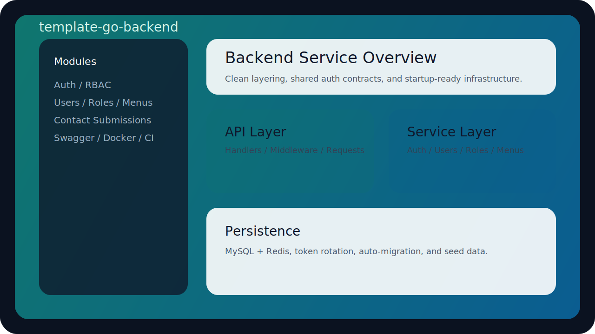
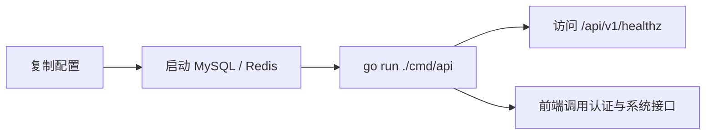
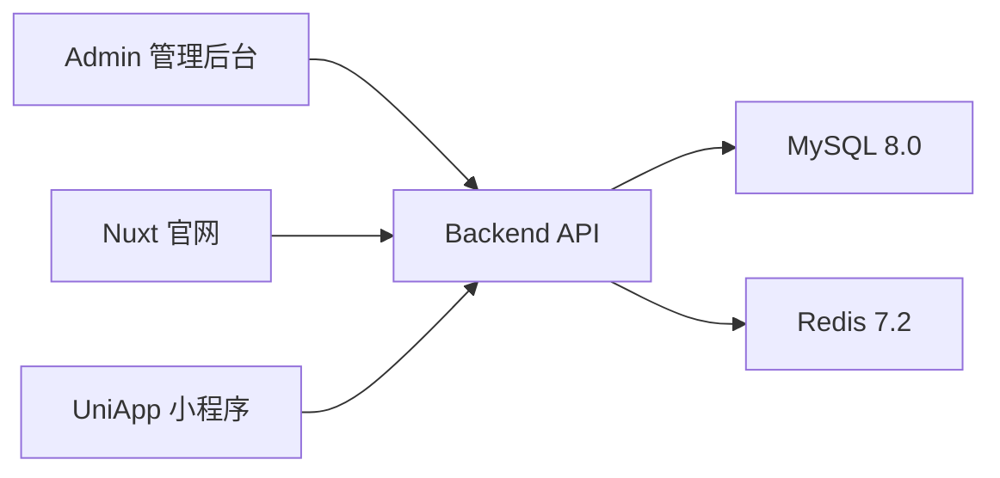
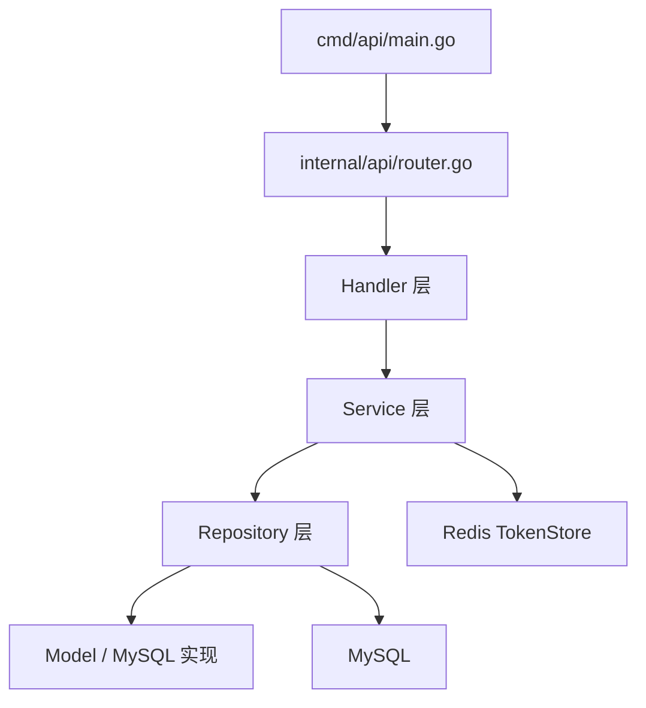
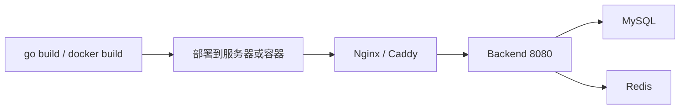

# template-go-backend


一套面向一人公司 / 小团队创业场景的 Golang 后端基础模板，内置认证、权限、用户体系、菜单体系、联系人表单、配置管理、日志、容器化与基础 CI，可作为后续业务项目的稳定底座。

## 预览占位图



## 1. 项目定位

- 技术定位：`Gin + GORM + Viper + Zap + JWT + Redis + MySQL`
- 架构定位：遵循 `API -> Service -> Repository` 分层，避免把业务逻辑堆到入口文件
- 使用场景：后台管理系统、官网表单服务、小程序统一认证后端

## 2. 技术栈

- Go `1.22.10`
- Gin `1.9.1`
- GORM `1.25.12`
- Viper `1.18.2`
- Zap `1.26.0`
- Validator `10.27.0`
- JWT `5.3.1`
- MySQL `8.0.45`
- Redis `7.2.13`

## 3. 快速开始总览图



## 4. 架构图

### 4.1 系统交互图



### 4.2 后端分层图



## 5. 目录结构

- `cmd/api`：服务启动入口，只负责装配依赖和启动 HTTP 服务
- `internal/api`：Handler、中间件、请求结构体、路由注册
- `internal/service`：核心业务逻辑
- `internal/repository`：Repository 接口、模型与 MySQL 实现
- `internal/config`：配置结构与配置加载
- `internal/utils`：错误、响应、密码、Token、Request ID 等通用工具
- `configs`：本地 / 环境配置文件
- `docs`：OpenAPI 文档占位
- `scripts`：开发与构建脚本
- `pkg`：对外可复用公共包

## 6. 已内置模块

- 健康检查：`GET /api/v1/healthz`
- 登录：`POST /api/v1/auth/login`
- 刷新 Token：`POST /api/v1/auth/refresh`
- 登出：`POST /api/v1/auth/logout`
- 当前用户：`GET /api/v1/auth/profile`
- 用户管理：`/api/v1/system/users`
- 角色管理：`/api/v1/system/roles`
- 菜单管理：`/api/v1/system/menus`
- 官网联系人表单：`POST /api/v1/public/contact-submissions`

## 7. 本地开发使用方式

### 7.1 环境准备

- 安装 Go `1.22.10`
- 安装并启动 Docker Desktop
- 准备 MySQL / Redis，或者直接使用仓库内 `docker-compose.yml`

### 7.2 初始化配置

```powershell
Copy-Item .env.example .env
$env:APP_CONFIG = "configs/config.local.yaml"
```

### 7.3 启动依赖

```powershell
docker compose up -d
```

### 7.4 启动服务

```powershell
go run ./cmd/api
```

默认启动地址：

- API：`http://localhost:8080`
- 文档文件：`http://localhost:8080/docs/swagger.yaml`

### 7.5 默认账号

- 用户名：`admin`
- 密码：`Admin123!`

首次启动会自动初始化默认菜单、角色与管理员账号。

## 8. 常用命令

```powershell
go test ./...
go build ./cmd/api
powershell -ExecutionPolicy Bypass -File .\scripts\bootstrap.ps1
```

## 9. 配置说明

主配置文件：[`configs/config.local.yaml`](/D:/NexAI/code/backend/configs/config.local.yaml)

关键配置项：

- `app`：应用名、环境、调试模式
- `http`：监听地址、超时、允许跨域来源
- `database`：MySQL DSN 与连接池
- `redis`：刷新 Token 存储
- `jwt`：签发者、密钥、Access / Refresh 过期时间

## 10. 部署方式

### 10.1 部署总览图



### 10.2 Docker 部署

适合测试环境、小型线上环境、单机部署。

```powershell
docker compose up -d mysql redis
docker build -t template-go-backend:latest .
docker run -d --name template-go-backend `
  -p 8080:8080 `
  -e APP_CONFIG=configs/config.local.yaml `
  template-go-backend:latest
```

### 10.3 二进制部署

适合已有 Linux 服务器、希望自行托管进程。

```powershell
go build -o app ./cmd/api
```

将以下内容部署到服务器：

- 编译产物 `app`
- 目录 `configs/`
- 目录 `docs/`

然后通过 systemd、Supervisor 或其他进程守护方式启动。

### 10.4 反向代理建议

- Nginx / Caddy 暴露 `80/443`
- `/api/` 反向代理到后端 `8080`
- 如官网与管理后台同域部署，可由反向代理统一分发静态资源与 API

## 11. 验证结果

当前模板已实际通过：

- `go test ./...`
- `go build ./cmd/api`

## 12. 扩展建议

- 在 `internal/service` 中新增订单、商品、支付等业务模块
- 在 `internal/repository/model` 中扩展业务模型
- 在 `internal/api/handler` 中新增控制器
- 若后续接入多租户，优先从 Claims、Repository 查询条件、模型公共字段统一扩展

